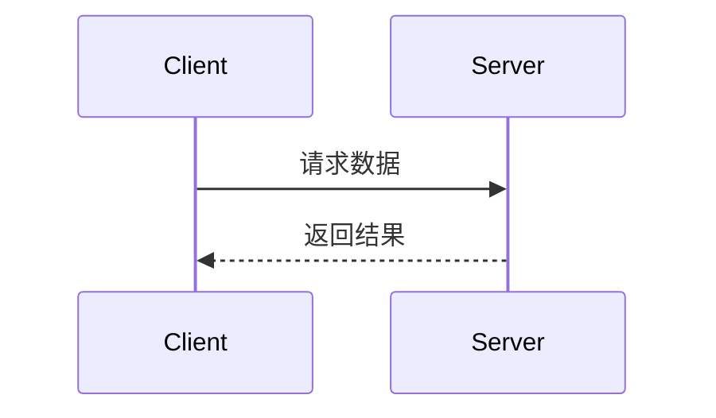

> 本文根据公开飞书教程整理，并把同一类方法合并成连续章节。版本、价格和功能名称可能变化，操作前请以 Cursor 官方文档和当前界面为准。
>
> 原始知识库入口：[AI编程快乐屋](https://my.feishu.cn/wiki/V5slwCIkUimnjKkyJuEcJiW0nuc)。

## 原教程：Cursor实战经验分享

> 如果你是在使用手机端浏览，请点击左上角有个“ 三条杠” 图标，点击后就能展开左侧的菜单了

## 原教程：一个人一个月用cursor开发了一个大型项目

> 本视频地址：https://www.bilibili.com/video/BV1q19vYqEKA?spm_id_from=333.1387.collection.video_card.click

### 一、项目概况

连锁门店管理系统，客户用此系统管理二十多家零食店进销存和会员管理。系统包含五个端：

- 总部运营PC端

- 店长管理小程序

- 会员小程序

- 安卓POS收银端

- 仓储PDA端（二期未开始）

### 二、cursor承担的角色

| 项目 | 框架 | cursor承担开发百分比 | 我承担开发百分比 | 备注 |
| --- | --- | --- | --- | --- |
| 需求阶段 |  | 0% | 100% | 需求是固定的，不需要利用大模型能力来发散思考 |
| 数据库设计 |  | 0% | 100% | 核心的东西自己把控比较好，也可以先让cursor设计一版 |
| 所有的后端服务（java) | springboot | 70% | 30% | 简单的增删改查全部都是cursor完成，复杂一点需要自己动手 |
| 总部运营PC端 | Element-ui | 100% | 0% | 主要就是验收，发错误，这个项目非常大，但因为是后台项目，页面结构比较固定 |
| 店长管理小程序 | vant | 100% | 0% | 主要就是验收，发错误 |
| 会员小程序 | 原生 | 100% | 0% | 主要就是验收，发错误 |
| 安卓POS收银端 | 原生 | 90% | 10% | 一些涉及到跟其他设备交互，需要对接SDK，比如打印机，标签称之类的 |

### 三、与Cursor的配合流程

第一步：用cursor 完成项目的前端界面和模拟数据，这里可以先发给客户预览

第二步： 跟cursor一起完成后端服务的开发，输出前端项目的接口文档

第三步：按页面把对应的接口文档发给cursor, 让cursor完成功能的对接

第四步：功能测试，验收

### 四、总结

1、cursor 可以做大项目，但不能完全替代开发，需要监管和不断地调试

2、需求文档和接口文档仍然是非常重要，是约束和提高cursor能力非常重要的一环

3、cursor的claude从3.5到3.7 UI 能力真的增强非常多，如果用3.7来做这个项目，效率会提升非常多

4、对于中大型项目，最好是具备前端能力或者后端能力，这样会顺利非常多。对于小型项目，你只要明白自己想做什么，cursor都能帮你搞定

5、AI编程越来越强，我有点恐惧。。。。

## 原教程：零代码爆肝10个项目，我总结的cursor最佳实践

> 本视频地址：
https://www.bilibili.com/video/BV1Zio7YhEgB/?spm_id_from=333.1387.upload.video_card.click

### 一、你的第一个文档

### 二、文件夹

项目文件夹下包含所有的前后端、管理系统的文件目录

> 原文此处包含图片，当前版本保留文字说明；请查看原始飞书页面中的图片。

项目大了，为了减少上下文的长度，建议 分成三个文件夹

前端项目

后端项目

管理系统项目

### 三、技术栈

选择常用的技术栈，大模型的熟练度=互联网上常用的技术栈

前端 vue, react，bootstrap 等

后端 paython-flask, java-spring-boot 等

### 四、最重要的当然是rules

良好的rules设计能显著的减少错误的发生

- 全局的rules

> 全局Rules

> always

> - 始终优先选择简单方案
- 尽可能避免代码重复
  • 修改代码前，检查代码库中是否已存在相似功能或逻辑。
- 编写代码时需区分不同环境
  • 明确区分开发环境（dev）、测试环境（test）和生产环境（prod）。
- 谨慎修改代码
  • 仅针对明确需求进行更改，或确保修改内容与需求强相关且已被充分理解。
- 修复问题时避免引入新技术/模式
  • 优先彻底排查现有实现的可能性，若必须引入新方案，需同步移除旧逻辑以避免冗余。
- 保持代码库整洁有序
- 避免在文件中编写脚本
  • 尤其是仅需运行一次的脚本（如数据迁移临时脚本）。
- 控制单文件代码行数
  • 文件代码超过 200-300行 时需重构封装。
- 仅测试环境使用模拟数据
  • 开发与生产环境严禁使用模拟（Mock）数据。

- 禁止覆盖 .env 文件
  • 修改前需确认并征得同意。

> -专注任务相关的代码区域

> -不触碰与任务无关的代码

> - 为所有主要功能编写全面测试

> - 在功能运行良好后，避免对其模式和架构进行重大更改（除非明确要求）

> - 始终考虑代码变更可能影响的其他方法和代码区域

- 框架rules

[github.com](https://github.com/sanjeed5/awesome-cursor-rules-mdc/tree/main)

- 个性化rules

比如API的定义，git自动提交的规范

- 你经常碰到的问题，是属于你的rules

### 五、对话模式以及模型的选择

- Agent 最强大，超级能力

- Manual 处理细节问题

- Ask 咨询

- claude 3.7 sonnet

- claude 3.7 sonnet thinking

### 六、new chat

### 七、自动化测试

### 八、用 流程的话解决流程的问题

## 原教程：24小时极限开发！Cursor编程+DeepSeek大模型=小红对标账号分析系统

> 本视频地址：
https://www.bilibili.com/video/BV1BUQVYuENR/?spm_id_from=333.1387.upload.video_card.click

### 一、起源

> 原文此处包含图片，当前版本保留文字说明；请查看原始飞书页面中的图片。

### 二、框架的基本结构

PC网页+Coze工作流程

### 三、开发流程

1、根据图片梳理系统的核心需求

账号分析、笔记分析

2、完成coze 工作流的搭建

3、使用cursor 完成静态数据界面开发

> 原文此处包含图片，当前版本保留文字说明；请查看原始飞书页面中的图片。

4、使用cursor对接工作流接口

### 四、后续计划

1、将coze的调用放到python

2、增加笔记的仿写等一系列AI小工具

3、增加商业化功能

## 原教程：如何让Cursor写好Java代码 （上）：用Cursor生成一个好对接的接口文档

本视频地址：

[视频去哪了呢？_哔哩哔哩_bilibili](https://www.bilibili.com/video/BV1YsNvzDELv/)

undefined, 视频播放量 undefined、弹幕量 undefined、点赞数 undefined、投硬币枚数 undefined、收藏人数 undefined、转发人数 undefined, 视频作者 undefined, 作者简介 undefined，相关视频:

### 视频主题：

本次视频主题主要是分享怎么在用Cursor开发前端项目中，自动生成可以对接的标准接口文档，为后面快速生成后端项目做好准备。

有接口文档的目的，是能零代码把后端项目生成，且基本不需要花费太多时间联调

### 为什么会有接口文档？

所以说API是前端和后端沟通的桥梁。

如果没有API文档，用Cursor开发后端服务将会面临如下问题：

1、不知道开发什么接口

2、接口的出入参和前端的可能对不上，需要花费大量的时间来联调修改

### 接口文档应该包含哪些内容

- 分模块

- 接口名称

- 功能描述（重要）

- Url 地址

- 入参示例及参数说明

- 出参示例及参数说明

### 如何生成

- 生成前端项目的时候，使用模拟数据，保持统一的request 请求，这样非常方便切换真实的测试环境

在项目刚开始 或者你就想现在换成模拟数据的时候，可以使用下面的提示词

```text
所有的API请求需要支持Mock接口，请设置一个全局变量来控制是否开启Mock数据，在request 中统一进行mock数据的切换，每个mock数据按模块划分与API请求一一对应，命名规范: 模块+Mock.js
```

> 原文此处包含图片，当前版本保留文字说明；请查看原始飞书页面中的图片。

- 生成API文档，使用Rules

```text
## 项目开发规范

## 🎯 技术栈约定
- **前端框架**: Vue 3 + Composition API
- **UI组件库**: Vant 4 (移动端)
- **开发语言**: 原生JavaScript (不使用TypeScript)
- **状态管理**: Pinia
- **构建工具**: Vite
- **样式**: CSS3 + CSS Variables

## 📁 项目结构规范

### API模块组织
- API文件位置: @src/api/
- 命名规范: `模块名称 + Api.js` (如 @UserApi.js)
- Mock数据统一管理: @mockManager.js
- API入口文件: @index.js

### 文档组织
- API文档位置: @docs/
- 命名规范: `模块名称 + API.md` (如 @UserAPI.md)
- 项目文档: @README.md

## 🔧 API开发规范

### 1. API接口文件结构
每个API文件必须包含完整的JSDoc注释：

```javascript
/**
 * 接口名称
 * 功能描述：详细描述接口的作用
 * 入参：{ param1: 类型, param2: 类型 }
 * 返回参数：返回数据结构说明
 * url地址：/api/endpoint
 * 请求方式：GET/POST
 */
export function apiFunction(params) {
  return get('/api/endpoint', params)
}
```

### 2. Mock数据规范
- 所有API接口都必须在 @mockManager.js 中提供Mock实现
- Mock数据要真实、完整，符合实际业务场景
- 使用 `registerMockApi(method, url, handler)` 注册Mock接口
- 返回数据格式统一使用 `createSuccessResponse()` 和 `createErrorResponse()`

### 3. 请求方式限制
- **仅允许使用 GET 和 POST 两种请求方式**
- GET: 用于数据查询和获取
- POST: 用于数据创建、更新、删除

## 📖 API文档规范

### 文档同步要求
**当生成或修改API接口时，以下内容变更必须同步更新API文档：**
- 入参结构变更
- 返回参数变更  
- URL地址变更
- 请求方式变更

### 文档格式标准

#### 基本信息
```markdown
## 接口名称

**接口名称：** 简短描述接口功能
**功能描述：** 详细描述接口的业务用途
**接口地址：** /api/endpoint
**请求方式：** GET/POST
```

#### 功能说明
```markdown
### 功能说明
详细描述接口的业务逻辑，可以使用流程图或时序图：



#### 请求参数
```markdown
### 请求参数
```json
{
  "page": 1,
  "page_size": 10,
  "status": "active"
}
```

| 参数名 | 类型 | 必填 | 说明 | 示例值 |
|-------|------|-----|------|--------|
| page | int | 否 | 页码（默认1） | 2 |
| page_size | int | 否 | 每页数量（默认10） | 20 |
| status | string | 否 | 状态过滤 | active |
```

#### 响应参数
```markdown
### 响应参数
```json
{
  "error": 0,
  "body": {
    "user_id": 1,
    "username": "admin",
    "email": "admin@example.com",
    "status": "active"
  },
  "message": "获取用户基本信息成功",
  "success": true
}
```

| 参数名 | 类型 | 必填 | 说明 | 示例值 |
|-------|------|-----|------|--------|
| error | int | 是 | 错误码 | 0 |
| body | object | 是 | 响应数据 | |
| body.user_id | int | 是 | 用户ID | 1 |
| body.username | string | 是 | 用户名 | admin |
| body.email | string | 是 | 邮箱 | admin@example.com |
| body.status | string | 是 | 用户状态 | active |
| message | string | 是 | 响应消息 | 获取用户基本信息成功 |
| success | bool | 是 | 是否成功 | true |
```

**注意：** 如果body是对象，需要列出所有子字段，格式为 `body.字段名`

## 🎨 组件开发规范

### 组件结构
- 组件位置: @src/components/
- 按功能模块分目录组织
- 每个组件目录可包含README.md说明文档

### 页面组件
- 页面位置: @src/views/
- 按业务模块分目录组织
- 使用Composition API编写

## 🔄 开发流程

### API开发流程
1. 在对应的API文件中添加接口函数（带完整JSDoc注释）
2. 在 @mockManager.js 中添加Mock实现
3. 在对应的API文档中添加/更新接口文档
4. 在页面中调用API接口
5. 测试Mock数据和接口调用

### 组件开发流程
1. 创建组件文件，使用Vue 3 Composition API
2. 编写组件样式，使用CSS Variables
3. 如需要，创建组件使用文档
4. 在页面中引入和使用组件

## 🚫 开发限制

### 禁止事项
- 不允许在对话中使用 `npm run dev` 启动项目
- 不要在Vue页面中定义测试数据，所有数据必须来自后端服务或Mock接口
- 不要创建测试文档
- 页面组件嵌套不要超过三层

### 代码质量要求
- 每个方法行数不超过300行
- 遵循DRY原则，避免重复代码
- 使用描述性的变量、函数和类名
- 为复杂逻辑添加注释

## 📝 Git提交规范

完成功能开发后，需要进行commit操作，提交信息要清晰描述修改内容。

## 🌐 响应语言

始终使用简体中文回复用户。
```

## 原教程：如何用Cursor开发大项目，全流程讲解，干货十足

### 视频主题&项目背景

- 主题： 分享个人如何使用cursor 从0到1开发一个比较大的项目，使用的技术栈是vue+小程序+java

- 项目

一个B2B的订货商城及供应链全流程管理，包含的端有：

- 小程序商城端

- 供应商端

- 仓储物流端

- 司机配送端

- 销售端

- 后台管理系统

以上小程序端都是使用webview的方式

核心功能：

- 商城的基本功能: 正逆向订单、商品、购物车、优惠券、积分、钱包、充值、工单等

- 供应链的基本功能：采购、仓储出入库，司机配送（仓库功能比较简单，只是一个中转仓功能）

- 供应商基本功能：上品、财务核算、送货

目前项目大部分已完成，人数一人
个人技术栈：偏后端

使用工具： cursor主力+trae+augment(浅用）

### 整体流程

需求->原型页面->正式页面->后端开发->测试->上线

| 流程环节 | Cursor开发量 | 人工开发量 | 说明 | 输出 |
| --- | --- | --- | --- | --- |
| 需求 | 0% | 100% | 定制需求，大部分人工处理，其实需求更多是流程，老板是一个概念或者现有的流程，我们做的事情是线上化，效率化 | 基本上所有端（角色）的简要的需求功能 |
| 原型页面 | 100% | 0% | 全部AI生成，这部分是要给老板确认，目的是大方向不要错 | 原型界面&lt;br&gt;举例子：供应商小程序端 |
| 正式页面 | 100% | 0% | 生成正式界面和接口文档，这一步非常重要，如果做不好，可能后面前后端对接的时候将会是灾难性的 | 前端界面（可直接使用）&lt;br&gt;接口文档 |
| 后端开发 | 90% | 10% | 人工的部分只要是两种：&lt;br&gt;1、解决AI兜兜转转总是解决不了，因为AI很容易陷入一种自我满足的死循环中，一个简单的问题它可以处理的非常复杂，所以必须人工干预&lt;br&gt;2、手写一些通用性的功能，比如拦截器、日志类、权限验证、数据库初始化这些基本不变但又是非常重要的东西&lt;br&gt;人工建表80% | 服务 |
| 测试 | 50% | 50% | AI做单元测试，人工做联调测试 |  |

### Curosr开发流程

#### 原型部分

了解老板的核心需求，把核心需求列成功能点，通过功能点生成原型界面，目的是在最快的时间能出来一个东西，方便进行下一次沟通。

- 先出全部页面，再局部调整

> 原文此处包含图片，当前版本保留文字说明；请查看原始飞书页面中的图片。

配合UI提示词

> 你是一个专业的UI设计师，你需要根据我提供的需求文档来完成页面的设计

> 请仔细阅读 需求文档 @supplier.md， 现在需要输出高保真的原型图，请通过以下方式帮我完成所有界面的原型设计，并确保这些原型界面可以直接用于开发：

> 1、用户体验分析：先分析这个 App 的主要功能和用户需求，确定核心交互逻辑。

> 2、产品界面规划：作为产品经理，定义关键界面，确保信息架构合理。

> 3、高保真 UI 设计：作为 UI 设计师，设计贴近真实 iOS/Android 设计规范的界面，使用现代化的 UI 元素，使其具有良好的视觉体验。

> 4、HTML 原型实现：使用 HTML + Tailwind CSS（或 Bootstrap）生成所有原型界面，并使用 FontAwesome（或其他开源 UI 组件）让界面更加精美、接近真实的 App 设计。拆分代码文件，保持结构清晰：

> 5、每个界面应作为独立的 HTML 文件存放，例如 home.html、profile.html、settings.html 等。

> - index.html 作为主入口，不直接写入所有界面的 HTML 代码，而是使用 iframe 的方式嵌入这些 HTML 片段，并将所有页面直接平铺展示在 index 页面中，而不是跳转链接。

> - 真实感增强：  - 界面尺寸应模拟 iPhone 15 Pro，并让界面圆角化，使其更像真实的手机界面。

> - 使用真实的 UI 图片，而非占位符图片（可从 Unsplash、Pexels、Apple 官方 UI 资源中选择）。

> - 添加顶部状态栏（模拟 iOS 状态栏），并包含 App 导航栏（类似 iOS 底部 Tab Bar）。

> 请按照以上要求生成完整的 HTML 代码，并确保其可用于实际开发

> 原文此处包含图片，当前版本保留文字说明；请查看原始飞书页面中的图片。

使用claude-4-sonnet thinking 模式，出的效果非常好，后面就是对整体页面进行局部调整

用这个版本生成各个端的原型页面，跟老板确认需求，为下一步正式页面开发做好准备

#### *前端部分

##### 页面生成

生成前端界面目前普遍有三种办法

- 使用第三方的设计工具进行代码转换，比如figma-ai

- 使用截图的方式，丢给cursor让它模仿页面的中元素，结构，颜色等

- 使用提示词的方式直接生成

我主要用后两种，因为已经生成了原型，可以直接剪切原型的图片，让cursor生成代码，原型主要是结构和元素

| 前端类型 | 生成界面方法 | 生成的顺序 | 提示词 |
| --- | --- | --- | --- |
| 小程序/app/h5 | 截图/文字直接生成 | 先初始化一个空的框架，比如vue&lt;br&gt;在一个页面一个页面生成&lt;br&gt;对于通用型的界面，AI很容易识别并理解，比如我说”做一个充值界面“，就这几个字就够了，现生成出来，再细调 | 帮我生成一个适配移动端的h5空的框架，使用的技术是vue3+vant, 你只需要生成空的框架就行，不需要有任何示例测试页面。 |
| 后台管理系统 | 文字直接生成 | 先初始化一个空的框架，比如element-ui&lt;br&gt;然后生成管理菜单&lt;br&gt;再生成每个界面 | 帮我生成一个基于element-ui的后台管理系统框架，使用的技术是vue3+element-ui, 你只需要生成空的框架就行，不需要有任何示例测试页面。 |

##### API接口文档，定义统一返回值格式

接口文档非常重要，接口文档越早弄越好，如果没有接口文档，后面的前后端联调将是灾难性的。

在生成页面的时候，就要同时生成接口文档，可以配置以下rules来帮助我们自动生成，可以设置成always

```text
## 📖 API文档规范

### 文档同步要求
**当生成或修改API接口时，以下内容变更必须同步更新API文档：**
- 入参结构变更
- 返回参数变更  
- URL地址变更
- 请求方式变更

### 文档格式标准

#### 基本信息
```markdown
## 接口名称

**接口名称：** 简短描述接口功能
**功能描述：** 详细描述接口的业务用途
**接口地址：** /api/endpoint
**请求方式：** GET/POST
```

#### 功能说明
```markdown
### 功能说明
详细描述接口的业务逻辑，可以使用流程图或时序图：


#### 请求参数
```markdown
### 请求参数
```json
{
  "page": 1,
  "page_size": 10,
  "status": "active"
}
```

| 参数名 | 类型 | 必填 | 说明 | 示例值 |
|-------|------|-----|------|--------|
| page | int | 否 | 页码（默认1） | 2 |
| page_size | int | 否 | 每页数量（默认10） | 20 |
| status | string | 否 | 状态过滤 | active |
```

#### 响应参数
```markdown
### 响应参数
```json
{
  "error": 0,
  "body": {
    "user_id": 1,
    "username": "admin",
    "email": "admin@example.com",
    "status": "active"
  },
  "message": "获取用户基本信息成功",
  "success": true
}
```

| 参数名 | 类型 | 必填 | 说明 | 示例值 |
|-------|------|-----|------|--------|
| error | int | 是 | 错误码 | 0 |
| body | object | 是 | 响应数据 | |
| body.user_id | int | 是 | 用户ID | 1 |
| body.username | string | 是 | 用户名 | admin |
| body.email | string | 是 | 邮箱 | admin@example.com |
| body.status | string | 是 | 用户状态 | active |
| message | string | 是 | 响应消息 | 获取用户基本信息成功 |
| success | bool | 是 | 是否成功 | true |
```

**注意：** 如果body是对象，需要列出所有子字段，格式为 `body.字段名`
```

参数说明和功能描述最重要，这是我们生成后端部分的重要文档

#### *Java后端部分

- 准备好两份rules：

一个rules能描述你的java编码规范以及分层结构

一个是做你代码方法的索引，让cursor在生成代码的时候优先去找存在的方法，提高复用性

- 先用sprintboot.io 初始化一个空项目，手动分层建好，比如controller--> service-->mapper

##### 生成Mapper

根据表结构生成mapper, mapper 一般是通用的，可以用下面的提示词生成

```text
请读取 tables.md sql语句，为每个表生成独立entity,mapper接口以及对应的xml文件，要求包含通用的增加、删除、修改、查询方法，详细如下：
- 单个增加
- 批量增加
- 根据id 更新
- 通用查询，以entity 为condition
- 根据id查询
- 根据ids查询
- 根据id删除（软删除）
- 根据ids 删除（软删除）
```

根据rules和这个提示词生成mapper 后，算是完成了底层的通用性构造

> 原文此处包含图片，当前版本保留文字说明；请查看原始飞书页面中的图片。

##### 根据接口文档生成controller层和Service层的实现

###### 从前端到后端

这里一定要用任务细分的工具，不然经常会漏掉代码或者逻辑有问题，尽量一个模块（五六个接口以内）一次对话中完成。

任务细分的工具我推荐两个：

一个是之前我介绍的“一个神奇rules"

一个是MCP 工具 shrimp-task-REDACTED

[MCP Servers](https://mcp.so/server/mcp-shrimp-task-REDACTED/cjo4m06)

The largest collection of MCP Servers, including Awesome MCP Servers and Claude MCP integration. Search and discover MCP servers to enhance your AI capabilities.

先用plan模式进行分析，然后在用执行模式对任何进行执行

###### 从后端到前端

也可以让后端生成API文档，发到前端来生成界面

> 原文此处包含图片，当前版本保留文字说明；请查看原始飞书页面中的图片。

> 原文此处包含图片，当前版本保留文字说明；请查看原始飞书页面中的图片。

##### 根据mermaid或者自己描述流程来生成任务的视线或者MQ的实现

- 你可以使用流程图工具mermaid把整个任务处理的流程还画出来，然后转换成文字复制到cursor对话中

[Online FlowChart & Diagrams Editor - Mermaid Live Editor](https://mermaid.live/edit)

Diagram live with teammates in Mermaid Chart

- 你可以画流程图截图的方式放到对话上下文中

- 用文字的方式来实现流程。我一般用这种方式，把流程描述出来。

首先、然后、其次。。。

##### 问题

> 原文此处包含图片，当前版本保留文字说明；请查看原始飞书页面中的图片。

> 原文此处包含图片，当前版本保留文字说明；请查看原始飞书页面中的图片。

> 原文此处包含图片，当前版本保留文字说明；请查看原始飞书页面中的图片。

- 补全 rules

- 每次对话都要加上 需要注意的内容

> 原文此处包含图片，当前版本保留文字说明；请查看原始飞书页面中的图片。

### 工具&Rules分享

- MCP task-REDACTED

[MCP Servers](https://mcp.so/server/mcp-shrimp-task-REDACTED/cjo4m06)

The largest collection of MCP Servers, including Awesome MCP Servers and Claude MCP integration. Search and discover MCP servers to enhance your AI capabilities.

- Cursor 到 IDE 跳转

> 原文此处包含图片，当前版本保留文字说明；请查看原始飞书页面中的图片。

IDE到cursor跳转

> 原文此处包含图片，当前版本保留文字说明；请查看原始飞书页面中的图片。

### Rules

附件：java.zip

附件：前端.zip

## 原教程：全网最全！Cursor最好用的技巧

### 视频主题

本视频主要是讲解如何使用一些经验和技巧，让cursor生成的代码更准确，避免cursor降智、重复代码、“屎山” 代码。

让你用AI生成代码更加舒心。本次视频中后端代码以Java 举例。

### Cursor 三问

Cursor能不能做项目？

Cursor 写出的代码有没有bug ？

Cursor 写出的代码是否符合你的审美？

### 核心：对话与上下文

在cursor 中打开一个 “对话窗口”，可以进行 多次对话。

> 原文此处包含图片，当前版本保留文字说明；请查看原始飞书页面中的图片。

对话累积上下文有长度限制，超过长度后，AI会压缩上下文，可能会丢失关键信息，影响代码生成效果

#### 技巧

所以控制上下文，及时的切换上下文是一个非常重要的技巧

- 一个对话窗口只完成一个模块（预估2000行代码左右），如果大了再拆分，完成了就新开对话窗口

- 当cursor 出现需要你重开对话窗口的时候，尽量点击新开

> 原文此处包含图片，当前版本保留文字说明；请查看原始飞书页面中的图片。

### Cursor一次对话的简单逻辑（非顺序）

以下从这个逻辑流程中来优化每个单独的流程，从而提高整个代码的生成效果

### 高效代码检索

检索的目的是让cursor更好的理解代码，找到已经存在的方法，避免重复，从以下三点提升检索的效率

#### 技巧：详细的注释

cursor在检索代码会根据你的对话内容，提取中文、英文关键词进行代码检索

> 原文此处包含图片，当前版本保留文字说明；请查看原始飞书页面中的图片。

每个方法，类、接口都需要注释。

使用rules来达到这个效果。

需要在rules中添加以下规则

> 原文此处包含图片，当前版本保留文字说明；请查看原始飞书页面中的图片。

效果：

> 原文此处包含图片，当前版本保留文字说明；请查看原始飞书页面中的图片。

#### 技巧：已有功能的导航

创建一个md文档，专门记录已经存在的类，简要介绍类中的方法，让cursor 优先去阅读这个导航，这样能很快找到是否存在已完成的功能，类似图书馆找书

效果如下：

> 原文此处包含图片，当前版本保留文字说明；请查看原始飞书页面中的图片。

> 原文此处包含图片，当前版本保留文字说明；请查看原始飞书页面中的图片。

要有一个这样的md， 分为两步

- 自动触发生成

- 自动要求先阅读

这个仍然是在rules这种设置

生成

> 原文此处包含图片，当前版本保留文字说明；请查看原始飞书页面中的图片。

读取

> 原文此处包含图片，当前版本保留文字说明；请查看原始飞书页面中的图片。

### 代码片段+代码范围

当你对某一个或者多个代码文件进行调整时，如果在对话框中不 进行  @ 符号操作，那cursor 会检索整个代码库，降低效率

> 原文此处包含图片，当前版本保留文字说明；请查看原始飞书页面中的图片。

正确做法

> 原文此处包含图片，当前版本保留文字说明；请查看原始飞书页面中的图片。

#### 技巧：把关联的文件放到上下文中，或者使用上面的导航md文件

### 对话：最重要的技巧

先看个反例：

> 原文此处包含图片，当前版本保留文字说明；请查看原始飞书页面中的图片。

那如何与cursor对话才是好的对话？

对话模版：

#### 简单功能，直接说明问题和需求的关键信息

> 请你修改以下问题：
1、创建商品时需要验证商品名称是否唯一

> 2、修改商品时要同时修改关联的商品详情信息，包括商品名称，商品单位

> @商品服务 @商品详情服务

#### 相似的功能，让cursor参考已存在的方法或者类

> 原文此处包含图片，当前版本保留文字说明；请查看原始飞书页面中的图片。

#### 复杂功能，拆分成不同的任务

详细描述你的功能流程，并让cursor 按任务计划来完成这个功能。

cursor在1.2之后，会将复杂的问题自动拆分成todoList, 但是为了保证会触发，可以手动要求

所谓的详细就是包含核心点，基本要做到只要开发人员看到基本核心的代码都明白怎么写了。

你说的越详细，cursor就越不会出错

> 原文此处包含图片，当前版本保留文字说明；请查看原始飞书页面中的图片。

> 原文此处包含图片，当前版本保留文字说明；请查看原始飞书页面中的图片。

#### 不会做的功能，用对话rules分析拆解

> 原文此处包含图片，当前版本保留文字说明；请查看原始飞书页面中的图片。

### Rules=你的经验+开发规范/技巧

当你优化好上面的所有技巧，那么你需要最后一个 rules来帮你进行兜底，让cursor生成的代码不会跑偏。

#### 生成Rules的方法

##### 自动生成

rules的作用就是做全局的规范和限制，里面的内容可以来自你的经验和网上开源比较成熟的，你也可以使用

/Generate Cursor Rules

> 原文此处包含图片，当前版本保留文字说明；请查看原始飞书页面中的图片。

或者使用

/Generate Cursor Rules  描述你的需求

> /Generate Cursor Rules 帮我生成一个全局的rules, 内容是关于java springboot 的最佳开发规范

> /Generate Cursor Rules 帮我生成一个rules, 内容是要求每次cursor生成代码后，进行build和单元测试，并指定单元测试标准

开源rules

[GitHub - sanjeed5/awesome-cursor-rules-mdc: Curated list of awesome Cursor Rules .mdc files](https://github.com/sanjeed5/awesome-cursor-rules-mdc)

Curated list of awesome Cursor Rules .mdc files. Contribute to sanjeed5/awesome-cursor-rules-mdc development by creating an account on GitHub.

##### 纯手写

可以把自己的开发经验整理成文字，或者让AI帮你润色补充，放到cursor的rules中

#### Rules 越多越好？

太多的rules会让上下文变长，AI以完成任务为前提，会选择遗忘或者压缩rules的内容

##### 技巧：按ruleType拆分rules,每个rules文件建议不超过500行

- Always: 通用规范、常用技巧

- Attached： 代码文件后缀匹配

- Mannual： 手动引入

- Agent： agent自己发现并引用

### Memories

唠嗑式的让cursor记住你的开发习惯，跟rules的搭配一静一动

这就要求我们在观察Cursor返回的代码时，需要经常提出自己的意见

可以使用 “请记住：。。。。”来主动触发

一个比较典型的例子：

> 原文此处包含图片，当前版本保留文字说明；请查看原始飞书页面中的图片。

你可以要求cursor生成代码时，方法参数不要超过3个，超过了需要定义对象。

那么它会把这个计入到memories中，下次生成方法的时候会唤醒它这条记忆

### 开发流程

- 先出表->mapper-service 通用

- 一个模块一个模块开发，先开发独立模块，再开发交叉模块

比如，先开发账号、再开发权限，再开发商品

### 技巧汇总

| 类型 | 技巧 | 有用度 |
| --- | --- | --- |
| 上下文窗口 | 按模块划分&lt;br&gt;及时新开对话窗口 | 非常高 |
| 代码检索 | 使用rules自动生成中文注释，描述方法的基本用途&lt;br&gt;使用rules生成方法导航，让cursor能很快找到已经存在的方法 | 高 |
| 代码片段 | 使用 @符号或者  @folder符号，将需要修改的代码加入到上下文中 | 非常高 |
| 对话技巧 | 1、简单功能说明核心要点&lt;br&gt;2、复杂功能做任务拆分&lt;br&gt;3、不会做使用 rules做分析和计划 | 非常高 |
| rules | 自动生成rules&lt;br&gt;将开发经验，总结放到rules中 | 非常高 |
| memories | 智能存储开发习惯，智能关联 | 高 |

### 本视频使用的rules文件

附件：java-development.mdc

附件：global.mdc

附件：cmmand.mdc

附件：base.mdc

## 原教程：Cursor从0 到 1 开发超热门 APP "死了么"，全程录制，保姆级教学

> 原文此处包含图片，当前版本保留文字说明；请查看原始飞书页面中的图片。

### 建议的AI 编程工具

- 新手

Kiro、Antigravity、Trae、Cursor、Codebuddy

- 老手

Claude Code、Driod、OpenCode

本次演示，我们使用 Cursor+CloudBase，方便新手朋友直接上手

[Cursor 配置指南 | 腾讯云开发 CloudBase - 一站式后端云服务](https://docs.cloudbase.net/ai/cloudbase-ai-toolkit/ide-setup/cursor)

配置后，你可以在 Cursor 的 AI 对话中直接操作 CloudBase 服务。

> 调用 MCP CloudBase ,下载 CloudBase AI 开发规则到当前项目，目前的开发工具是 trae


